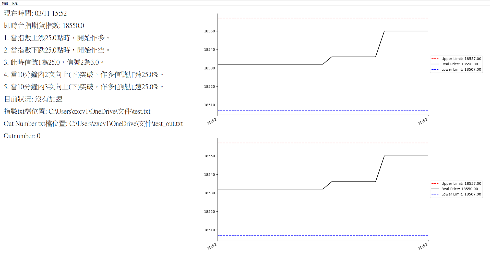

# 台指期貨門檻監控系統

本專案實作一套以 **Python GUI** 為基礎的即時監控工具，用於讀取外部價格資料並依據門檻條件計算交易訊號。

系統會持續讀取指定的價格 txt 檔，並即時顯示：

- 即時台指期貨指數
- 上下門檻位置
- 價格走勢圖
- 訊號數值 `Outnumber`
- 是否處於加速狀態

本工具主要用於觀察價格突破門檻時的市場變化。

---

# 系統介面

介面分為左右兩個區域：

**左側資訊區**

顯示系統目前狀態，包括：

- 現在時間
- 即時台指期貨指數
- 門檻與信號設定
- 是否處於加速狀態
- 價格 txt 檔位置
- Out Number txt 檔位置
- `Outnumber` 數值

**右側圖形區**

顯示兩張價格監控圖：

- 上方：完整價格走勢
- 下方：局部價格變化

圖中包含：

- 黑線：Real Price  
- 紅色虛線：Upper Limit  
- 藍色虛線：Lower Limit  

---

# 主要功能

### 即時價格監控

系統會持續讀取價格 txt 檔並更新目前指數。

---

### 門檻突破監控

當價格突破設定門檻時，系統會自動更新訊號數值 `Outnumber`。

---

### 連續突破加速機制

若價格在短時間內連續突破門檻，系統會進入加速狀態並提高訊號增量。

---

### 即時圖形顯示

系統會同步繪製價格走勢圖與門檻位置，方便即時觀察市場變化。

---

# 資料格式

系統會從 txt 檔讀取價格資料，例如：

18550

代表目前讀取的即時價格。

系統會將計算出的 `Outnumber` 輸出至另一個 txt 檔，例如：

0.00

---

# 說明

本 repo 僅包含程式原始碼與示範資料，不包含實際交易系統或客戶使用版本。
